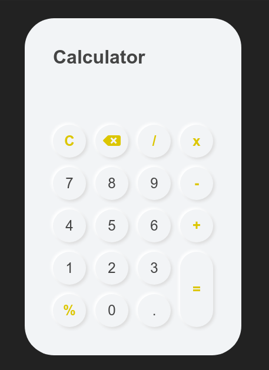

# Calculator

## Funcionamiento
1. La clase Calculator.ts es la encargada de instancias todas las teclas de la
   calcularora y de administrar las impresiones de los numeros en los displays
2. La clase Key.ts representa cualquier tecla que puede ser imprimible en el
   display de la calculadora. Dichas teclas tienen sus correspondientes
   atributos los cuales sirven para conocer el elemento HTML que representan
   o el valor de la tecla
3. La clase DisplaySingleton implementa el patron de diseño Singleton y su
   principal objetivo es devolver siempre la misma instancia de la clase para
   poder ser usadas por las distintas teclas que tiene la calculadora
   y siempre compartir ese mismo "estado" para saber si el display esta vacío
   o no, por ejemplo.

## Herramientas
- Typescript como lenguaje de programacion para poder sacarle mas provecho
y poder implementar mejor el patron de diseño Singleton, entre otras cosas
como usar de una forma mas explícita el polimorfismo.
- Sass como preprocesador de CSS, por gusto unicamente.
- Patrones de diseño y Programación Orientada a Objetos

